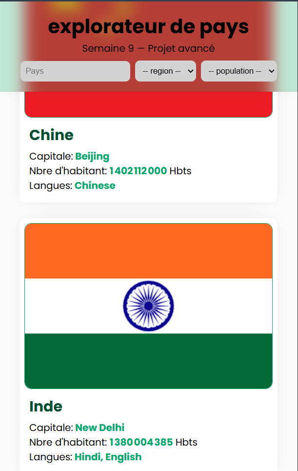

# projet9.3-cities-explorer

Application web assez simple permettant la recherche, le trie, et l'affichage de pays récupérer via une API public.

## Démo en ligne

[live demo](https://yggdrasil2024.github.io/projet9.3-countries-explorer/)

## Aperçu

### aparçu mobile


### aperçu desktop



## Fonctionnalités

voici la liste des fonctionnalité clé de l'app:

- Recherche d'un pays par son nom (en direct, insensible à la casse)(en dure dans le code pour l'instant)
- Filtrage par continent (Afrique, Europe, Asie, Amérique, Océanie)(en dure)
- Tri par population (croissant / décroissant)(en dure aussi)
- Affichage : drapeau, capitale, population (formatée avec séparateurs de milliers), langues parlées
- Noms de pays affichés en français quand la traduction est disponible(presque toujours le cas)
- États d'interface gérés : chargement (squelettes animés), résultat, erreur réseau, aucune correspondance
- Interface responsive (mobile à desktop)
- Respect de `prefers-reduced-motion` pour les animations

## 🛠️ Technologies utilisées

- **HTML5**: structure sémantique
- **CSS3**: variables CSS, Flexbox, Grid, media queries, animations
- **JavaScript (vanilla)**: `fetch`, `async/await`

## API utilisée

pour ce projet l'api utilisé est **[countries.dev](https://countries.dev/)**, une alternative à RestCountries, elle fournis pour chaque pays:

- son nom (avec traductions dans plusieurs langues)
- sa capitale, sa région(continent)
- sa population
- ses langues officielles
- ses drapeaux (PNG ou SVG selon celui disponible)

Endpoint utilisé : `GET https://countries.dev/countries` (renvoie un tableau JSON avec les 250 pays du monde). Aucune clé d'API n'est nécessaire ce qui est moins compliqué que RestCountries.

## Structure du projet

```
projet9.3-countries-explorer/
├── assets/
│   ├── img/
│   │   ├── home pc.png
│   │   └── mobile.png
│   └── styles/
│       └── style.css   #feuille de style
├── .gitignore
├── index.html          #structure
├── pays.js             #gestion de l'api et de la logique
└── README.md           #documentation
```

## Lancer le projet en local

1. Cloner le dépôt :

   ```bash
   git clone https://github.com/Yggdrasil2024/projet9.3-countries-explorer.git && cd projet9.3-countries-explorer
   ```

2. Ouvrir `index.html` via un serveur local (l'API fonctionne mal en ouverture directe `file://`) :
   - avec l'extension **Live Server**

## Auteur

[BIKOUTA Guyverna](https://github.com/Yggdrasil2024)

_junior sofware ingineer | cohorte 2 akieni academy_
